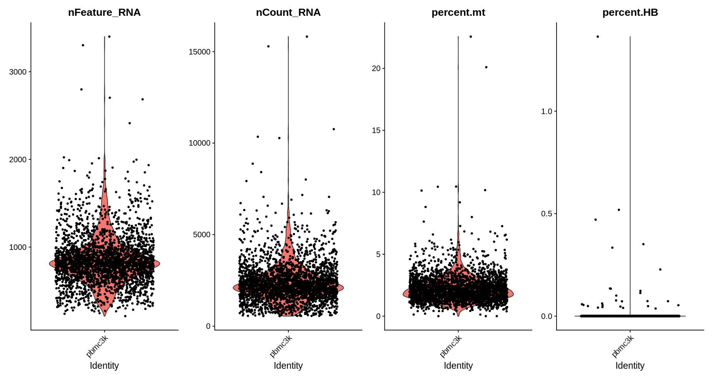
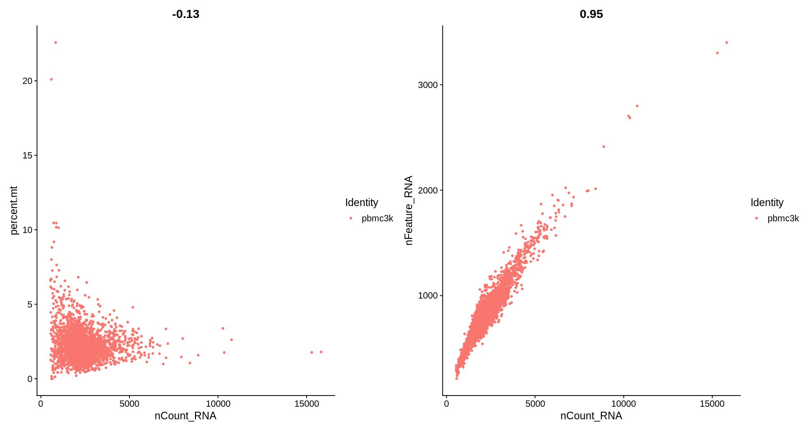
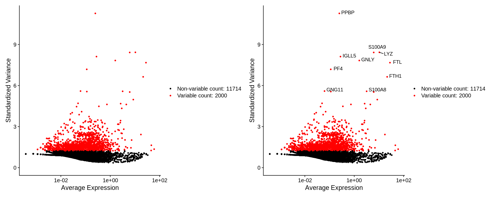
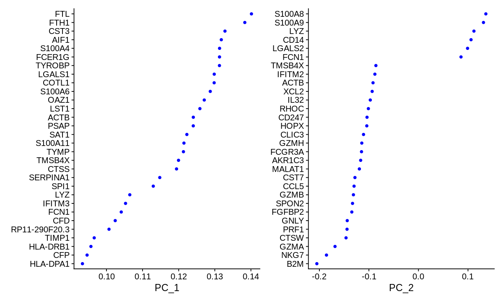
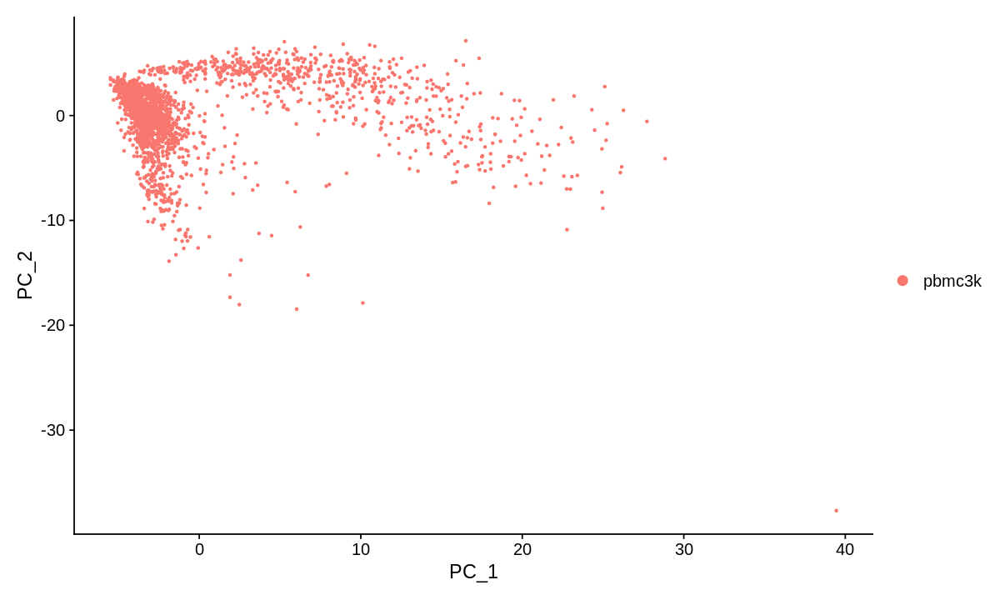

# Seurat - Guided Clustering Tutorial

> https://satijalab.org/seurat/articles/pbmc3k_tutorial.html


```R
setwd("/sibcb2/bioinformatics2/wangjiahao/JupyterLab/study/scRNA_seq")
source("~/.yyds")
startSC()
```

    [1] "Start    Tue Jan 18 14:50:10 2022"


## 介绍

- Peripheral Blood Mononuclear Cells (PBMC)
- 10X Genomics
- 2,700 single cells
- Illumina NextSeq 500

## 查看数据
[原始数据](https://cf.10xgenomics.com/samples/cell/pbmc3k/pbmc3k_filtered_gene_bc_matrices.tar.gz), 在导入数据之前先看一下数据的格式


```R
hd(read.table("raw/filtered_gene_bc_matrices/hg19/barcodes.tsv"))
```

    dim: 2700 × 1 


<table class="dataframe">
<caption>A data.frame: 5 × 1</caption>
<thead>
	<tr><th></th><th scope=col>V1</th></tr>
	<tr><th></th><th scope=col>&lt;chr&gt;</th></tr>
</thead>
<tbody>
	<tr><th scope=row>1</th><td>AAACATACAACCAC-1</td></tr>
	<tr><th scope=row>2</th><td>AAACATTGAGCTAC-1</td></tr>
	<tr><th scope=row>3</th><td>AAACATTGATCAGC-1</td></tr>
	<tr><th scope=row>4</th><td>AAACCGTGCTTCCG-1</td></tr>
	<tr><th scope=row>5</th><td>AAACCGTGTATGCG-1</td></tr>
</tbody>
</table>


保存的是每个细胞所对应的 barcode, 可以一看到一共有2700个细胞


```R
hd(read.table("raw/filtered_gene_bc_matrices/hg19/genes.tsv"))
```

    dim: 32738 × 2 


<table class="dataframe">
<caption>A data.frame: 5 × 2</caption>
<thead>
	<tr><th></th><th scope=col>V1</th><th scope=col>V2</th></tr>
	<tr><th></th><th scope=col>&lt;chr&gt;</th><th scope=col>&lt;chr&gt;</th></tr>
</thead>
<tbody>
	<tr><th scope=row>1</th><td>ENSG00000243485</td><td>MIR1302-10  </td></tr>
	<tr><th scope=row>2</th><td>ENSG00000237613</td><td>FAM138A     </td></tr>
	<tr><th scope=row>3</th><td>ENSG00000186092</td><td>OR4F5       </td></tr>
	<tr><th scope=row>4</th><td>ENSG00000238009</td><td>RP11-34P13.7</td></tr>
	<tr><th scope=row>5</th><td>ENSG00000239945</td><td>RP11-34P13.8</td></tr>
</tbody>
</table>


保存的是每个基因的 ENSEMBL id 及对应的 SYMBOL id


```R
hd(cbind(readLines("raw/filtered_gene_bc_matrices/hg19/matrix.mtx")))
```

    dim: 2286887 × 1 


<table class="dataframe">
<caption>A data.frame: 5 × 1</caption>
<thead>
	<tr><th scope=col>obj.1.x..1.y.</th></tr>
	<tr><th scope=col>&lt;chr&gt;</th></tr>
</thead>
<tbody>
	<tr><td>%%MatrixMarket matrix coordinate real general</td></tr>
	<tr><td>%                                            </td></tr>
	<tr><td>32738 2700 2286884                           </td></tr>
	<tr><td>32709 1 4                                    </td></tr>
	<tr><td>32707 1 1                                    </td></tr>
</tbody>
</table>


- 这个是测序的主要结果内容，前两行大概是介绍啥的
- 第三列，第一个数字表示测得的总基因数，第二个数字代表测得的总细胞数，第三个数代表下面数据里的总非零值数
- 之后就是三列的数据，第一列是基因，数字代表第上面二个表格中的位置；第二列是细胞，数字代表上面第一个表格中的位置；第三列代表count数

## 导入数据
- 使用 `Read10X` 函数直接导入 [**cellranger**](https://support.10xgenomics.com/single-cell-gene-expression/software/pipelines/latest/what-is-cell-ranger) pipeline 所处理的 10X 数据的结果
- 随后使用 `CreateSeuratObject` 函数创建 **seruat** 对象


```R
loadp(dplyr, Seurat, patchwork)
pbmc.data <- Read10X(data.dir = "raw/filtered_gene_bc_matrices/hg19/")
# Initialize the Seurat object with the raw (non-normalized data).
pbmc <- CreateSeuratObject(counts = pbmc.data, project = "pbmc3k", min.cells = 3, min.features = 200)
pbmc
```

    Warning message:
    “Feature names cannot have underscores ('_'), replacing with dashes ('-')”


    An object of class Seurat 
    13714 features across 2700 samples within 1 assay 
    Active assay: RNA (13714 features, 0 variable features)


查看生成的这两个对象


```R
str(pbmc.data)
```

    Formal class 'dgCMatrix' [package "Matrix"] with 6 slots
      ..@ i       : int [1:2286884] 70 166 178 326 363 410 412 492 494 495 ...
      ..@ p       : int [1:2701] 0 781 2133 3264 4224 4746 5528 6311 7101 7634 ...
      ..@ Dim     : int [1:2] 32738 2700
      ..@ Dimnames:List of 2
      .. ..$ : chr [1:32738] "MIR1302-10" "FAM138A" "OR4F5" "RP11-34P13.7" ...
      .. ..$ : chr [1:2700] "AAACATACAACCAC-1" "AAACATTGAGCTAC-1" "AAACATTGATCAGC-1" "AAACCGTGCTTCCG-1" ...
      ..@ x       : num [1:2286884] 1 1 2 1 1 1 1 41 1 1 ...
      ..@ factors : list()


```R
# 查看前30个细胞一些基因的count数据
pbmc.data[c("CD3D", "TCL1A", "MS4A1"), 1:30]
```

       [[ suppressing 30 column names ‘AAACATACAACCAC-1’, ‘AAACATTGAGCTAC-1’, ‘AAACATTGATCAGC-1’ ... ]]
    


    3 x 30 sparse Matrix of class "dgCMatrix"
                                                                       
    CD3D  4 . 10 . . 1 2 3 1 . . 2 7 1 . . 1 3 . 2  3 . . . . . 3 4 1 5
    TCL1A . .  . . . . . . 1 . . . . . . . . . . .  . 1 . . . . . . . .
    MS4A1 . 6  . . . . . . 1 1 1 . . . . . . . . . 36 1 2 . . 2 . . . .


- 由于单细胞测序得到的矩阵大部分的值为0，因此使用**稀疏矩阵 (sparse-matrix)**会节省对象所占的空间，其中`.`即表示数值为0的数据.
- 以下代码说明这里内存压缩了23倍呢！


```R
dense.size <- object.size(as.matrix(pbmc.data)); dense.size
sparse.size <- object.size(pbmc.data); sparse.size
dense.size/sparse.size
```


    709591472 bytes


    29905192 bytes


    23.7 bytes


```R
# 查看pbmc对象
str(pbmc)
```

    Formal class 'Seurat' [package "Seurat"] with 13 slots
      ..@ assays      :List of 1
      .. ..$ RNA:Formal class 'Assay' [package "Seurat"] with 8 slots
      .. .. .. ..@ counts       :Formal class 'dgCMatrix' [package "Matrix"] with 6 slots
      .. .. .. .. .. ..@ i       : int [1:2282976] 29 73 80 148 163 184 186 227 229 230 ...
      .. .. .. .. .. ..@ p       : int [1:2701] 0 779 2131 3260 4220 4741 5522 6304 7094 7626 ...
      .. .. .. .. .. ..@ Dim     : int [1:2] 13714 2700
      .. .. .. .. .. ..@ Dimnames:List of 2
      .. .. .. .. .. .. ..$ : chr [1:13714] "AL627309.1" "AP006222.2" "RP11-206L10.2" "RP11-206L10.9" ...
      .. .. .. .. .. .. ..$ : chr [1:2700] "AAACATACAACCAC-1" "AAACATTGAGCTAC-1" "AAACATTGATCAGC-1" "AAACCGTGCTTCCG-1" ...
      .. .. .. .. .. ..@ x       : num [1:2282976] 1 1 2 1 1 1 1 41 1 1 ...
      .. .. .. .. .. ..@ factors : list()
      .. .. .. ..@ data         :Formal class 'dgCMatrix' [package "Matrix"] with 6 slots
      .. .. .. .. .. ..@ i       : int [1:2282976] 29 73 80 148 163 184 186 227 229 230 ...
      .. .. .. .. .. ..@ p       : int [1:2701] 0 779 2131 3260 4220 4741 5522 6304 7094 7626 ...
      .. .. .. .. .. ..@ Dim     : int [1:2] 13714 2700
      .. .. .. .. .. ..@ Dimnames:List of 2
      .. .. .. .. .. .. ..$ : chr [1:13714] "AL627309.1" "AP006222.2" "RP11-206L10.2" "RP11-206L10.9" ...
      .. .. .. .. .. .. ..$ : chr [1:2700] "AAACATACAACCAC-1" "AAACATTGAGCTAC-1" "AAACATTGATCAGC-1" "AAACCGTGCTTCCG-1" ...
      .. .. .. .. .. ..@ x       : num [1:2282976] 1 1 2 1 1 1 1 41 1 1 ...
      .. .. .. .. .. ..@ factors : list()
      .. .. .. ..@ scale.data   : num[0 , 0 ] 
      .. .. .. ..@ key          : chr "rna_"
      .. .. .. ..@ assay.orig   : NULL
      .. .. .. ..@ var.features : logi(0) 
      .. .. .. ..@ meta.features:'data.frame':	13714 obs. of  0 variables
      .. .. .. ..@ misc         : NULL
      ..@ meta.data   :'data.frame':	2700 obs. of  3 variables:
      .. ..$ orig.ident  : Factor w/ 1 level "pbmc3k": 1 1 1 1 1 1 1 1 1 1 ...
      .. ..$ nCount_RNA  : num [1:2700] 2419 4903 3147 2639 980 ...
      .. ..$ nFeature_RNA: int [1:2700] 779 1352 1129 960 521 781 782 790 532 550 ...
      ..@ active.assay: chr "RNA"
      ..@ active.ident: Factor w/ 1 level "pbmc3k": 1 1 1 1 1 1 1 1 1 1 ...
      .. ..- attr(*, "names")= chr [1:2700] "AAACATACAACCAC-1" "AAACATTGAGCTAC-1" "AAACATTGATCAGC-1" "AAACCGTGCTTCCG-1" ...
      ..@ graphs      : list()
      ..@ neighbors   : list()
      ..@ reductions  : list()
      ..@ images      : list()
      ..@ project.name: chr "pbmc3k"
      ..@ misc        : list()
      ..@ version     :Classes 'package_version', 'numeric_version'  hidden list of 1
      .. ..$ : int [1:3] 3 2 2
      ..@ commands    : list()
      ..@ tools       : list()


- 可以看出这里定义了一个类, 类名为 `Seurat`, pbmc 是这个类的一个实例
- 而`Seurat`对象内部的元素类型也包括了其他的类(`Assay`, `dgCMatrix`)、列表、矩阵、数据框、字符串等等
- 在 R 中类对象(class object) 内容(slot)使用`@`进行提取, 数据库、列表的元素使用`$`进行提取
- 其中比较重要的内容包括原始count数据, 标准化、正则化之后的数据, 以及元数据`meta.data`


```R
hd(pbmc@assays$RNA@counts)
```

    dim: 13714 × 2700 


<table class="dataframe">
<caption>A data.frame: 5 × 5</caption>
<thead>
	<tr><th></th><th scope=col>AAACATACAACCAC-1</th><th scope=col>AAACATTGAGCTAC-1</th><th scope=col>AAACATTGATCAGC-1</th><th scope=col>AAACCGTGCTTCCG-1</th><th scope=col>AAACCGTGTATGCG-1</th></tr>
	<tr><th></th><th scope=col>&lt;dbl&gt;</th><th scope=col>&lt;dbl&gt;</th><th scope=col>&lt;dbl&gt;</th><th scope=col>&lt;dbl&gt;</th><th scope=col>&lt;dbl&gt;</th></tr>
</thead>
<tbody>
	<tr><th scope=row>AL627309.1</th><td>0</td><td>0</td><td>0</td><td>0</td><td>0</td></tr>
	<tr><th scope=row>AP006222.2</th><td>0</td><td>0</td><td>0</td><td>0</td><td>0</td></tr>
	<tr><th scope=row>RP11-206L10.2</th><td>0</td><td>0</td><td>0</td><td>0</td><td>0</td></tr>
	<tr><th scope=row>RP11-206L10.9</th><td>0</td><td>0</td><td>0</td><td>0</td><td>0</td></tr>
	<tr><th scope=row>LINC00115</th><td>0</td><td>0</td><td>0</td><td>0</td><td>0</td></tr>
</tbody>
</table>


```R
head(pbmc@meta.data)
```


<table class="dataframe">
<caption>A data.frame: 6 × 3</caption>
<thead>
	<tr><th></th><th scope=col>orig.ident</th><th scope=col>nCount_RNA</th><th scope=col>nFeature_RNA</th></tr>
	<tr><th></th><th scope=col>&lt;fct&gt;</th><th scope=col>&lt;dbl&gt;</th><th scope=col>&lt;int&gt;</th></tr>
</thead>
<tbody>
	<tr><th scope=row>AAACATACAACCAC-1</th><td>pbmc3k</td><td>2419</td><td> 779</td></tr>
	<tr><th scope=row>AAACATTGAGCTAC-1</th><td>pbmc3k</td><td>4903</td><td>1352</td></tr>
	<tr><th scope=row>AAACATTGATCAGC-1</th><td>pbmc3k</td><td>3147</td><td>1129</td></tr>
	<tr><th scope=row>AAACCGTGCTTCCG-1</th><td>pbmc3k</td><td>2639</td><td> 960</td></tr>
	<tr><th scope=row>AAACCGTGTATGCG-1</th><td>pbmc3k</td><td> 980</td><td> 521</td></tr>
	<tr><th scope=row>AAACGCACTGGTAC-1</th><td>pbmc3k</td><td>2163</td><td> 781</td></tr>
</tbody>
</table>


- 元数据中`orig.ident`代表 **origin identity**, 是 sereut 对象默认的细胞分类（或者说细胞特征？）指标, 目前默认全部是创建对象时所提供的项目名称 **pbmc3k**
- 后两列的指标在创建对象时自动计算的，分别表示count数和unique gene数
- 以后所有的细胞相关信息都会保存在这里，所以是经常用到的内容

## 标准预处理流程

Selection and filtration of cells based on QC metrics, data normalization and scaling, and the detection of highly variable features
- 基于QC指标挑选和过滤细胞
- 数据标准化、等比例缩放(scaling, 翻译过来好别扭)
- 检测高变异基因

### QC
通常使用的QC标准如下：
- 每个细胞检测的unique基因个数
  - 低质量的细胞和空的滴液通常会得到较少的基因
  - 包含双细胞或多细胞的滴液一般会得到异常多的基因count数
- 同样的，单个细胞检测到的总分子数同样可以作为参考，因为其与unique基因个数是正相关的
- 比对到线粒体基因组上的reads的比例
  - 低质量或趋于死亡的细胞通常具有广泛的线粒体污染
  - 使用`PercentageFeatureSet`函数计算线粒体的质控指标，该函数可以计算包含一组特征(基因)的counts所占的比例
  - 以下代码展示计算每个细胞线粒体count的比例，`^MT-`表示以`MT-`开头的基因，即为线粒体基因


```R
pbmc[["percent.mt"]] <- PercentageFeatureSet(pbmc, pattern = "^MT-")
```

还可以计算红细胞比例，红细胞没有细胞核，没有转录组，如果红细胞marker基因比例很高，则可判定细胞为红细胞


```R
HB.genes <- c("HBA1","HBA2","HBB","HBD","HBE1","HBG1","HBG2","HBM","HBQ1","HBZ")
HB_m <- match(HB.genes, rownames(pbmc@assays$RNA)) 
HB.genes <- rownames(pbmc@assays$RNA)[HB_m] 
HB.genes <- HB.genes[!is.na(HB.genes)] 
pbmc[["percent.HB"]] <- PercentageFeatureSet(pbmc, features=HB.genes) 
```

这时候我们可以看到元数据中多了两列数据


```R
head(pbmc@meta.data)
```


<table class="dataframe">
<caption>A data.frame: 6 × 5</caption>
<thead>
	<tr><th></th><th scope=col>orig.ident</th><th scope=col>nCount_RNA</th><th scope=col>nFeature_RNA</th><th scope=col>percent.mt</th><th scope=col>percent.HB</th></tr>
	<tr><th></th><th scope=col>&lt;fct&gt;</th><th scope=col>&lt;dbl&gt;</th><th scope=col>&lt;int&gt;</th><th scope=col>&lt;dbl&gt;</th><th scope=col>&lt;dbl&gt;</th></tr>
</thead>
<tbody>
	<tr><th scope=row>AAACATACAACCAC-1</th><td>pbmc3k</td><td>2419</td><td> 779</td><td>3.0177759</td><td>0</td></tr>
	<tr><th scope=row>AAACATTGAGCTAC-1</th><td>pbmc3k</td><td>4903</td><td>1352</td><td>3.7935958</td><td>0</td></tr>
	<tr><th scope=row>AAACATTGATCAGC-1</th><td>pbmc3k</td><td>3147</td><td>1129</td><td>0.8897363</td><td>0</td></tr>
	<tr><th scope=row>AAACCGTGCTTCCG-1</th><td>pbmc3k</td><td>2639</td><td> 960</td><td>1.7430845</td><td>0</td></tr>
	<tr><th scope=row>AAACCGTGTATGCG-1</th><td>pbmc3k</td><td> 980</td><td> 521</td><td>1.2244898</td><td>0</td></tr>
	<tr><th scope=row>AAACGCACTGGTAC-1</th><td>pbmc3k</td><td>2163</td><td> 781</td><td>1.6643551</td><td>0</td></tr>
</tbody>
</table>


### 可视化QC指标


```R
# Visualize QC metrics as a violin plot
options(repr.plot.width = 15, repr.plot.height = 8)
VlnPlot(pbmc, features = c("nFeature_RNA", "nCount_RNA", "percent.mt", "percent.HB"), ncol = 4)
```


    

    


除此之外，还能通过 `FeatureScatter` 函数同时展示两个指标


```R
plot1 <- FeatureScatter(pbmc, feature1 = "nCount_RNA", feature2 = "percent.mt")
plot2 <- FeatureScatter(pbmc, feature1 = "nCount_RNA", feature2 = "nFeature_RNA")
plot1 + plot2
```


    

    


### 过滤细胞

一般来说，基因个数大于200小于2500, 线粒体基因含量要小于10%，红细胞基因含量小于3%


```R
pbmc
pbmc <- subset(pbmc, nFeature_RNA > 200 & nFeature_RNA < 2500 & percent.mt < 5 & percent.HB < 3)
pbmc
```


    An object of class Seurat 
    13714 features across 2700 samples within 1 assay 
    Active assay: RNA (13714 features, 0 variable features)


    An object of class Seurat 
    13714 features across 2638 samples within 1 assay 
    Active assay: RNA (13714 features, 0 variable features)


## 标准化

- 由于各种原因，比如RNA含量差异、捕获效率差异、扩增效率不同、测序深度不同，最终得到的结果具有很大的噪音，必须排除以显示真正的生物差异，因此数据在分析之前需要进行标准化
- 另外，与bulk-RNA-seq不同，由于基于droplet的scRNA-seq建库方式的特殊性(一个探针捕获一个RNA并且是单端测序)，不需要对基因长度进行矫正，
- 矫正的方法最长用的是 **LogNormalize**，具体参见 [单细胞测序-scRNA-seq数据的标准化处理](https://www.jianshu.com/p/2302e685edaf)

使用总表达量对每个细胞的基因表达水平进行标准化, 采用一种**全局尺度归一化方法** (global-scaling normalization method “LogNormalize”), 将其乘以比例因子（默认为10000, how it works?), 这两个参数值均为默认。


```R
pbmc <- NormalizeData(pbmc, normalization.method = "LogNormalize", scale.factor = 10000)
```

## 鉴定高变基因 -- 特征挑选

- 即挑选出在细胞之间表达差异较大的基因, 后续分析将只使用这些基因
- `FindVariableFeatures` 函数执行这个功能, 默认挑选出2000个高变基因


```R
pbmc <- FindVariableFeatures(pbmc, selection.method = "vst", nfeatures = 2000)

# 鉴定top10高变基因
top10 <- head(VariableFeatures(pbmc), 10)

# 可视化高变基因, 有标签、无标签两种方式
plot1 <- VariableFeaturePlot(pbmc)
plot2 <- LabelPoints(plot = plot1, points = top10, repel = TRUE)
options(repr.plot.width = 15, repr.plot.height = 6)
plot1 + plot2
```

    When using repel, set xnudge and ynudge to 0 for optimal results
    
    Warning message:
    “Transformation introduced infinite values in continuous x-axis”
    Warning message:
    “Removed 1 rows containing missing values (geom_point).”
    Warning message:
    “Transformation introduced infinite values in continuous x-axis”
    Warning message:
    “Removed 1 rows containing missing values (geom_point).”


    

    


## 归一化(scaling)

- 对原始数据进行标准化后显示出了基因的真实表达情况，但是不同的基因的表达水平仍然会存在几个数量级的差异，如果不进行处理则较高水平的信号
会遮盖住水平较低的信号，而**归一化**就是为了避免这个问题。
- `ScaleData` 函数执行这一任务
  - 平移每个基因的表达，使细胞间的平均表达值为0
  - 缩放每个基因的表达，使细胞间的差异为1
    - 这一步骤使得所有基因在下游分析中具有同等的权重，因此高表达基因不会占主导地位
  - 结果存储在`pbmc[["RNA"]]@scale.data` 中


```R
all.genes <- rownames(pbmc)
pbmc <- ScaleData(pbmc, features = all.genes)
hd(pbmc@assays$RNA@scale.data)
```

    Centering and scaling data matrix
    


    dim: 13714 × 2638 


<table class="dataframe">
<caption>A data.frame: 5 × 5</caption>
<thead>
	<tr><th></th><th scope=col>AAACATACAACCAC-1</th><th scope=col>AAACATTGAGCTAC-1</th><th scope=col>AAACATTGATCAGC-1</th><th scope=col>AAACCGTGCTTCCG-1</th><th scope=col>AAACCGTGTATGCG-1</th></tr>
	<tr><th></th><th scope=col>&lt;dbl&gt;</th><th scope=col>&lt;dbl&gt;</th><th scope=col>&lt;dbl&gt;</th><th scope=col>&lt;dbl&gt;</th><th scope=col>&lt;dbl&gt;</th></tr>
</thead>
<tbody>
	<tr><th scope=row>AL627309.1</th><td>-0.05849835</td><td>-0.05849835</td><td>-0.05849835</td><td>-0.05849835</td><td>-0.05849835</td></tr>
	<tr><th scope=row>AP006222.2</th><td>-0.03373556</td><td>-0.03373556</td><td>-0.03373556</td><td>-0.03373556</td><td>-0.03373556</td></tr>
	<tr><th scope=row>RP11-206L10.2</th><td>-0.04356896</td><td>-0.04356896</td><td>-0.04356896</td><td>-0.04356896</td><td>-0.04356896</td></tr>
	<tr><th scope=row>RP11-206L10.9</th><td>-0.03373556</td><td>-0.03373556</td><td>-0.03373556</td><td>-0.03373556</td><td>-0.03373556</td></tr>
	<tr><th scope=row>LINC00115</th><td>-0.08287113</td><td>-0.08287113</td><td>-0.08287113</td><td>-0.08287113</td><td>-0.08287113</td></tr>
</tbody>
</table>


- 以上方法对所有的基因都进行了归一化，为了提高速度，默认只对前文中筛选的高变基因进行归一化
- PCA和聚类分析只使用高变基因，因此不会被影响。但是后续画热图时需确保涉及的基因都已经被归一化

## 线性降维

- 接下来对归一化后的数据进行降维，默认只将高变基因作为输入，也可以使用`features`手动指定其他的基因集
- PCA过程由`RunPCA`函数执行，


```R
pbmc <- RunPCA(pbmc, features = VariableFeatures(object = pbmc))
```

    PC_ 1 
    Positive:  FTL, FTH1, CST3, AIF1, S100A4, FCER1G, TYROBP, LGALS1, COTL1, S100A6 
    	   OAZ1, LST1, ACTB, PSAP, SAT1, S100A11, TYMP, TMSB4X, CTSS, SERPINA1 
    	   SPI1, LYZ, IFITM3, FCN1, CFD, RP11-290F20.3, TIMP1, HLA-DRB1, CFP, HLA-DPA1 
    Negative:  MALAT1, IL32, LTB, IL7R, CCL5, CTSW, GZMA, NKG7, CD27, CD247 
    	   CD2, GZMK, CST7, ACAP1, GZMH, HOPX, LINC00926, BEX2, FGFBP2, TCL1A 
    	   GNLY, MYC, NCR3, STK17A, AQP3, SAMD3, SLC2A3, ZAP70, SPON2, MS4A1 
    PC_ 2 
    Positive:  S100A8, S100A9, LYZ, CD14, LGALS2, FCN1, GRN, MS4A6A, RBP7, GSTP1 
    	   S100A12, FTL, C19orf59, ID1, TYROBP, FOLR3, TYMP, S100A6, CST3, GPX1 
    	   FCGR1A, IL8, ASGR1, PLBD1, LGALS3, RETN, ALDH2, FCGRT, TMEM176B, LGALS1 
    Negative:  B2M, NKG7, GZMA, CTSW, PRF1, GNLY, FGFBP2, SPON2, GZMB, CCL5 
    	   CST7, MALAT1, AKR1C3, FCGR3A, GZMH, CLIC3, HOPX, CD247, RHOC, IL32 
    	   XCL2, ACTB, IFITM2, TMSB4X, CTSC, APMAP, UBB, XCL1, TTC38, CCL4 
    PC_ 3 
    Positive:  CD74, HLA-DRA, HLA-DPB1, HLA-DQA1, HLA-DQB1, HLA-DPA1, HLA-DRB1, HLA-DQA2, HLA-DRB5, B2M 
    	   NKG7, CD1C, GZMA, MALAT1, PLAC8, PRF1, GNLY, HLA-DMB, CTSW, GZMB 
    	   FGFBP2, VIM, SPON2, CLEC10A, UBB, CST7, PLD4, CLIC3, AKR1C3, FCER1A 
    Negative:  PPBP, GNG11, SPARC, PF4, AP001189.4, ITGA2B, SDPR, CD9, CLU, GP9 
    	   TREML1, NRGN, LY6G6F, CMTM5, TUBB1, RGS18, RP11-367G6.3, GP1BA, F13A1, C6orf25 
    	   CA2, SCGB1C1, GPX1, RUFY1, CLDN5, SEPT5, CLEC1B, ITGB3, HIST1H2AC, HGD 
    PC_ 4 
    Positive:  CD74, HLA-DQA1, HLA-DQB1, HLA-DQA2, HLA-DRA, HLA-DPB1, HLA-DRB1, HLA-DPA1, HLA-DRB5, CD1C 
    	   CD79A, MS4A1, HLA-DMB, CD79B, HLA-DMA, LINC00926, CLEC10A, TCL1A, FCER1A, PLD4 
    	   CD37, FCGR2B, CLIC2, ITM2C, PPP1R14A, IRF8, GPX1, LTB, SERPINF1, BLNK 
    Negative:  FCGR3A, NKG7, FTL, RP11-290F20.3, S100A4, LST1, FCER1G, AIF1, TYROBP, SERPINA1 
    	   GZMA, LILRA3, S100A6, S100A8, CFD, GNLY, FGFBP2, SPON2, MS4A7, S100A9 
    	   CTSS, PRF1, S100A11, FTH1, CTSW, RHOC, IFITM2, PSAP, FCN1, CST7 
    PC_ 5 
    Positive:  FCGR3A, RP11-290F20.3, MS4A7, MALAT1, CKB, IFITM2, LTB, LST1, RHOC, SIGLEC10 
    	   HMOX1, LILRA3, AIF1, TIMP1, CD79B, COTL1, SERPINA1, TMSB4X, VMO1, FCER1G 
    	   PPM1N, MT-CO2, CEBPB, CYTIP, IFITM3, IL7R, FAM110A, CTD-2006K23.1, LYN, GSTA4 
    Negative:  NKG7, LYZ, S100A9, S100A8, GNLY, GZMA, SPON2, FGFBP2, GPX1, CD14 
    	   GZMB, PRF1, LGALS2, GSTP1, CTSW, CST7, AKR1C3, GRN, CLIC3, GZMH 
    	   CCL3, CCL5, XCL2, CCL4, MS4A6A, HOPX, ID1, XCL1, FCN1, APMAP 
    


Seurat 提供了一些有用的用于可视化定义PCA的细胞和基因, 包括：`VizDimReduction`, `DimPlot`, `DimHeatmap`.


```R
# Examine and visualize PCA results a few different ways
print(pbmc[["pca"]], dims = 1:5, nfeatures = 5)
```

    PC_ 1 
    Positive:  FTL, FTH1, CST3, AIF1, S100A4 
    Negative:  MALAT1, IL32, LTB, IL7R, CCL5 
    PC_ 2 
    Positive:  S100A8, S100A9, LYZ, CD14, LGALS2 
    Negative:  B2M, NKG7, GZMA, CTSW, PRF1 
    PC_ 3 
    Positive:  CD74, HLA-DRA, HLA-DPB1, HLA-DQA1, HLA-DQB1 
    Negative:  PPBP, GNG11, SPARC, PF4, AP001189.4 
    PC_ 4 
    Positive:  CD74, HLA-DQA1, HLA-DQB1, HLA-DQA2, HLA-DRA 
    Negative:  FCGR3A, NKG7, FTL, RP11-290F20.3, S100A4 
    PC_ 5 
    Positive:  FCGR3A, RP11-290F20.3, MS4A7, MALAT1, CKB 
    Negative:  NKG7, LYZ, S100A9, S100A8, GNLY 


```R
options(repr.plot.width = 10, repr.plot.height = 6)
VizDimLoadings(pbmc, dims = 1:2, reduction = "pca")
```


    

    


```R
DimPlot(pbmc, reduction = "pca")
```


    

    


- 特别的, `DimHeatmap` 可以更直观地展示数据中异质性的来源，这对下游分析的PC挑选非常有帮助
- 细胞和基因均按照PCA分数排序，设置`cells`参数可指定表达谱图中两边的细胞个数上限
- 虽然这显然是一个有监督的分析，但我们发现这是探索相关特征集的一个有价值的工具。


```R
str(pbmc)
```

    Formal class 'Seurat' [package "Seurat"] with 13 slots
      ..@ assays      :List of 1
      .. ..$ RNA:Formal class 'Assay' [package "Seurat"] with 8 slots
      .. .. .. ..@ counts       :Formal class 'dgCMatrix' [package "Matrix"] with 6 slots
      .. .. .. .. .. ..@ i       : int [1:2238732] 29 73 80 148 163 184 186 227 229 230 ...
      .. .. .. .. .. ..@ p       : int [1:2639] 0 779 2131 3260 4220 4741 5522 6304 7094 7626 ...
      .. .. .. .. .. ..@ Dim     : int [1:2] 13714 2638
      .. .. .. .. .. ..@ Dimnames:List of 2
      .. .. .. .. .. .. ..$ : chr [1:13714] "AL627309.1" "AP006222.2" "RP11-206L10.2" "RP11-206L10.9" ...
      .. .. .. .. .. .. ..$ : chr [1:2638] "AAACATACAACCAC-1" "AAACATTGAGCTAC-1" "AAACATTGATCAGC-1" "AAACCGTGCTTCCG-1" ...
      .. .. .. .. .. ..@ x       : num [1:2238732] 1 1 2 1 1 1 1 41 1 1 ...
      .. .. .. .. .. ..@ factors : list()
      .. .. .. ..@ data         :Formal class 'dgCMatrix' [package "Matrix"] with 6 slots
      .. .. .. .. .. ..@ i       : int [1:2238732] 29 73 80 148 163 184 186 227 229 230 ...
      .. .. .. .. .. ..@ p       : int [1:2639] 0 779 2131 3260 4220 4741 5522 6304 7094 7626 ...
      .. .. .. .. .. ..@ Dim     : int [1:2] 13714 2638
      .. .. .. .. .. ..@ Dimnames:List of 2
      .. .. .. .. .. .. ..$ : chr [1:13714] "AL627309.1" "AP006222.2" "RP11-206L10.2" "RP11-206L10.9" ...
      .. .. .. .. .. .. ..$ : chr [1:2638] "AAACATACAACCAC-1" "AAACATTGAGCTAC-1" "AAACATTGATCAGC-1" "AAACCGTGCTTCCG-1" ...
      .. .. .. .. .. ..@ x       : num [1:2238732] 1 1 2 1 1 1 1 41 1 1 ...
      .. .. .. .. .. ..@ factors : list()
      .. .. .. ..@ scale.data   : num [1:13714, 1:2638] -0.0585 -0.0337 -0.0436 -0.0337 -0.0829 ...
      .. .. .. .. ..- attr(*, "dimnames")=List of 2
      .. .. .. .. .. ..$ : chr [1:13714] "AL627309.1" "AP006222.2" "RP11-206L10.2" "RP11-206L10.9" ...
      .. .. .. .. .. ..$ : chr [1:2638] "AAACATACAACCAC-1" "AAACATTGAGCTAC-1" "AAACATTGATCAGC-1" "AAACCGTGCTTCCG-1" ...
      .. .. .. ..@ key          : chr "rna_"
      .. .. .. ..@ assay.orig   : NULL
      .. .. .. ..@ var.features : chr [1:2000] "PPBP" "LYZ" "S100A9" "IGLL5" ...
      .. .. .. ..@ meta.features:'data.frame':	13714 obs. of  5 variables:
      .. .. .. .. ..$ vst.mean                 : num [1:13714] 0.00341 0.00114 0.0019 0.00114 0.00682 ...
      .. .. .. .. ..$ vst.variance             : num [1:13714] 0.0034 0.00114 0.00189 0.00114 0.00678 ...
      .. .. .. .. ..$ vst.variance.expected    : num [1:13714] 0.00365 0.00114 0.00197 0.00114 0.00748 ...
      .. .. .. .. ..$ vst.variance.standardized: num [1:13714] 0.933 0.992 0.963 0.992 0.906 ...
      .. .. .. .. ..$ vst.variable             : logi [1:13714] FALSE FALSE FALSE FALSE FALSE FALSE ...
      .. .. .. ..@ misc         : NULL
      ..@ meta.data   :'data.frame':	2638 obs. of  5 variables:
      .. ..$ orig.ident  : Factor w/ 1 level "pbmc3k": 1 1 1 1 1 1 1 1 1 1 ...
      .. ..$ nCount_RNA  : num [1:2638] 2419 4903 3147 2639 980 ...
      .. ..$ nFeature_RNA: int [1:2638] 779 1352 1129 960 521 781 782 790 532 550 ...
      .. ..$ percent.mt  : num [1:2638] 3.02 3.79 0.89 1.74 1.22 ...
      .. ..$ percent.HB  : num [1:2638] 0 0 0 0 0 0 0 0 0 0 ...
      ..@ active.assay: chr "RNA"
      ..@ active.ident: Factor w/ 1 level "pbmc3k": 1 1 1 1 1 1 1 1 1 1 ...
      .. ..- attr(*, "names")= chr [1:2638] "AAACATACAACCAC-1" "AAACATTGAGCTAC-1" "AAACATTGATCAGC-1" "AAACCGTGCTTCCG-1" ...
      ..@ graphs      : list()
      ..@ neighbors   : list()
      ..@ reductions  :List of 1
      .. ..$ pca:Formal class 'DimReduc' [package "Seurat"] with 9 slots
      .. .. .. ..@ cell.embeddings           : num [1:2638, 1:50] -3.49 2.21 -1.63 7.42 -3.98 ...
      .. .. .. .. ..- attr(*, "dimnames")=List of 2
      .. .. .. .. .. ..$ : chr [1:2638] "AAACATACAACCAC-1" "AAACATTGAGCTAC-1" "AAACATTGATCAGC-1" "AAACCGTGCTTCCG-1" ...
      .. .. .. .. .. ..$ : chr [1:50] "PC_1" "PC_2" "PC_3" "PC_4" ...
      .. .. .. ..@ feature.loadings          : num [1:2000, 1:50] 0.00498 0.10646 0.07057 -0.00227 -0.01213 ...
      .. .. .. .. ..- attr(*, "dimnames")=List of 2
      .. .. .. .. .. ..$ : chr [1:2000] "PPBP" "LYZ" "S100A9" "IGLL5" ...
      .. .. .. .. .. ..$ : chr [1:50] "PC_1" "PC_2" "PC_3" "PC_4" ...
      .. .. .. ..@ feature.loadings.projected: num[0 , 0 ] 
      .. .. .. ..@ assay.used                : chr "RNA"
      .. .. .. ..@ global                    : logi FALSE
      .. .. .. ..@ stdev                     : num [1:50] 6.12 3.29 3.16 3.01 2.7 ...
      .. .. .. ..@ key                       : chr "PC_"
      .. .. .. ..@ jackstraw                 :Formal class 'JackStrawData' [package "Seurat"] with 4 slots
      .. .. .. .. .. ..@ empirical.p.values     : num[0 , 0 ] 
      .. .. .. .. .. ..@ fake.reduction.scores  : num[0 , 0 ] 
      .. .. .. .. .. ..@ empirical.p.values.full: num[0 , 0 ] 
      .. .. .. .. .. ..@ overall.p.values       : num[0 , 0 ] 
      .. .. .. ..@ misc                      :List of 1
      .. .. .. .. ..$ total.variance: num 622
      ..@ images      : list()
      ..@ project.name: chr "pbmc3k"
      ..@ misc        : list()
      ..@ version     :Classes 'package_version', 'numeric_version'  hidden list of 1
      .. ..$ : int [1:3] 3 2 2
      ..@ commands    :List of 3
      .. ..$ FindVariableFeatures.RNA:Formal class 'SeuratCommand' [package "Seurat"] with 5 slots
      .. .. .. ..@ name       : chr "FindVariableFeatures.RNA"
      .. .. .. ..@ time.stamp : POSIXct[1:1], format: "2022-01-18 16:04:57"
      .. .. .. ..@ assay.used : chr "RNA"
      .. .. .. ..@ call.string: chr "FindVariableFeatures(pbmc, selection.method = \"vst\", nfeatures = 2000)"
      .. .. .. ..@ params     :List of 12
      .. .. .. .. ..$ assay              : chr "RNA"
      .. .. .. .. ..$ selection.method   : chr "vst"
      .. .. .. .. ..$ loess.span         : num 0.3
      .. .. .. .. ..$ clip.max           : chr "auto"
      .. .. .. .. ..$ mean.function      :function (mat, display_progress)  
      .. .. .. .. ..$ dispersion.function:function (mat, display_progress)  
      .. .. .. .. ..$ num.bin            : num 20
      .. .. .. .. ..$ binning.method     : chr "equal_width"
      .. .. .. .. ..$ nfeatures          : num 2000
      .. .. .. .. ..$ mean.cutoff        : num [1:2] 0.1 8
      .. .. .. .. ..$ dispersion.cutoff  : num [1:2] 1 Inf
      .. .. .. .. ..$ verbose            : logi TRUE
      .. ..$ ScaleData.RNA           :Formal class 'SeuratCommand' [package "Seurat"] with 5 slots
      .. .. .. ..@ name       : chr "ScaleData.RNA"
      .. .. .. ..@ time.stamp : POSIXct[1:1], format: "2022-01-18 18:21:16"
      .. .. .. ..@ assay.used : chr "RNA"
      .. .. .. ..@ call.string: chr "ScaleData(pbmc, features = all.genes)"
      .. .. .. ..@ params     :List of 10
      .. .. .. .. ..$ features          : chr [1:13714] "AL627309.1" "AP006222.2" "RP11-206L10.2" "RP11-206L10.9" ...
      .. .. .. .. ..$ assay             : chr "RNA"
      .. .. .. .. ..$ model.use         : chr "linear"
      .. .. .. .. ..$ use.umi           : logi FALSE
      .. .. .. .. ..$ do.scale          : logi TRUE
      .. .. .. .. ..$ do.center         : logi TRUE
      .. .. .. .. ..$ scale.max         : num 10
      .. .. .. .. ..$ block.size        : num 1000
      .. .. .. .. ..$ min.cells.to.block: num 2638
      .. .. .. .. ..$ verbose           : logi TRUE
      .. ..$ RunPCA.RNA              :Formal class 'SeuratCommand' [package "Seurat"] with 5 slots
      .. .. .. ..@ name       : chr "RunPCA.RNA"
      .. .. .. ..@ time.stamp : POSIXct[1:1], format: "2022-01-18 18:41:02"
      .. .. .. ..@ assay.used : chr "RNA"
      .. .. .. ..@ call.string: chr "RunPCA(pbmc, features = VariableFeatures(object = pbmc))"
      .. .. .. ..@ params     :List of 11
      .. .. .. .. ..$ assay          : chr "RNA"
      .. .. .. .. ..$ features       : chr [1:2000] "PPBP" "LYZ" "S100A9" "IGLL5" ...
      .. .. .. .. ..$ npcs           : num 50
      .. .. .. .. ..$ rev.pca        : logi FALSE
      .. .. .. .. ..$ weight.by.var  : logi TRUE
      .. .. .. .. ..$ verbose        : logi TRUE
      .. .. .. .. ..$ ndims.print    : int [1:5] 1 2 3 4 5
      .. .. .. .. ..$ nfeatures.print: num 30
      .. .. .. .. ..$ reduction.name : chr "pca"
      .. .. .. .. ..$ reduction.key  : chr "PC_"
      .. .. .. .. ..$ seed.use       : num 42
      ..@ tools       : list()


```R
str(pbmc@reductions)
```

    List of 1
     $ pca:Formal class 'DimReduc' [package "Seurat"] with 9 slots
      .. ..@ cell.embeddings           : num [1:2638, 1:50] -3.49 2.21 -1.63 7.42 -3.98 ...
      .. .. ..- attr(*, "dimnames")=List of 2
      .. .. .. ..$ : chr [1:2638] "AAACATACAACCAC-1" "AAACATTGAGCTAC-1" "AAACATTGATCAGC-1" "AAACCGTGCTTCCG-1" ...
      .. .. .. ..$ : chr [1:50] "PC_1" "PC_2" "PC_3" "PC_4" ...
      .. ..@ feature.loadings          : num [1:2000, 1:50] 0.00498 0.10646 0.07057 -0.00227 -0.01213 ...
      .. .. ..- attr(*, "dimnames")=List of 2
      .. .. .. ..$ : chr [1:2000] "PPBP" "LYZ" "S100A9" "IGLL5" ...
      .. .. .. ..$ : chr [1:50] "PC_1" "PC_2" "PC_3" "PC_4" ...
      .. ..@ feature.loadings.projected: num[0 , 0 ] 
      .. ..@ assay.used                : chr "RNA"
      .. ..@ global                    : logi FALSE
      .. ..@ stdev                     : num [1:50] 6.12 3.29 3.16 3.01 2.7 ...
      .. ..@ key                       : chr "PC_"
      .. ..@ jackstraw                 :Formal class 'JackStrawData' [package "Seurat"] with 4 slots
      .. .. .. ..@ empirical.p.values     : num[0 , 0 ] 
      .. .. .. ..@ fake.reduction.scores  : num[0 , 0 ] 
      .. .. .. ..@ empirical.p.values.full: num[0 , 0 ] 
      .. .. .. ..@ overall.p.values       : num[0 , 0 ] 
      .. ..@ misc                      :List of 1
      .. .. ..$ total.variance: num 622


```R
hd(pbmc@reductions$pca@cell.embeddings)
```

    dim: 2638 × 50 


<table class="dataframe">
<caption>A data.frame: 5 × 5</caption>
<thead>
	<tr><th></th><th scope=col>PC_1</th><th scope=col>PC_2</th><th scope=col>PC_3</th><th scope=col>PC_4</th><th scope=col>PC_5</th></tr>
	<tr><th></th><th scope=col>&lt;dbl&gt;</th><th scope=col>&lt;dbl&gt;</th><th scope=col>&lt;dbl&gt;</th><th scope=col>&lt;dbl&gt;</th><th scope=col>&lt;dbl&gt;</th></tr>
</thead>
<tbody>
	<tr><th scope=row>AAACATACAACCAC-1</th><td>-3.491602</td><td>-0.5323857</td><td> 0.3486351</td><td>-0.6915652</td><td> 0.4999531</td></tr>
	<tr><th scope=row>AAACATTGAGCTAC-1</th><td> 2.213197</td><td>-2.6658518</td><td> 4.0490797</td><td> 9.8986579</td><td> 2.4485788</td></tr>
	<tr><th scope=row>AAACATTGATCAGC-1</th><td>-1.634313</td><td>-3.0381645</td><td> 0.7883247</td><td> 0.3398866</td><td> 2.1507040</td></tr>
	<tr><th scope=row>AAACCGTGCTTCCG-1</th><td> 7.420740</td><td> 2.5572035</td><td>-0.1397878</td><td>-1.5016835</td><td> 0.1903648</td></tr>
	<tr><th scope=row>AAACCGTGTATGCG-1</th><td>-3.980650</td><td>-0.9362398</td><td> 0.4099098</td><td>-2.0673209</td><td>-3.2146702</td></tr>
</tbody>
</table>


